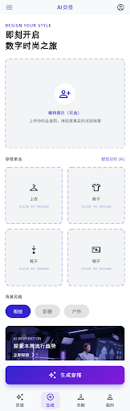
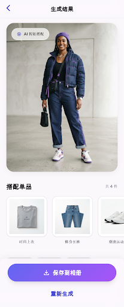

# AI 穿搭生成小程序

上传上衣、裤子、鞋子、帽子等单品图片（可选上传模特全身照），调用生图模型 API 生成一张模特完整穿搭效果图。

UI 由 [Google Stitch](https://stitch.withgoogle.com) 生成设计稿后转写为原生微信小程序页面；生图逻辑参考 [gemini-ai-tryon](https://github.com/oyeolamilekan/gemini-ai-tryon)。

## 设计稿

| 首页 | 结果页 |
| --- | --- |
|  |  |

## 目录结构

```
miniprogram/           # 微信小程序（原生，带 tabBar：首页/衣柜/收藏/我的）
  pages/index/         # 首页：上传单品（可从衣柜选）+ 模特照片 + 背景风格 + 生成
  pages/wardrobe/      # 我的衣柜：批量上传、自动分类、跨分类选择后用于生成
  pages/collection/    # 套装收藏：收藏的生成效果图
  pages/result/        # 结果页：效果图 + 收藏套装 + 保存到相册 + 重新生成
  pages/picker/        # 从衣柜选择单品（首页调用）
  utils/api.js         # 登录/衣柜/收藏接口封装（自动携带 token）
  config.js            # 后端 API 地址配置
server/                # Node.js (Express) 后端，调用生图模型 API；SQLite 存账号/衣柜/收藏
docs/                  # Stitch 生成的设计稿
```

## 运行后端

```bash
cd server
npm install
cp .env.example .env   # 填入 ARK_API_KEY（火山方舟）、OPENAI_API_KEY（OpenAI 兼容网关）或 GEMINI_API_KEY
npm start              # 默认 http://localhost:3000
```

后端接口 `POST /api/tryon` 会立即返回异步任务号，JSON body：

```json
{
  "items": {
    "top":   { "data": "<base64>", "mimeType": "image/jpeg" },
    "pants": { "data": "<base64>", "mimeType": "image/jpeg" },
    "shoes": { "data": "<base64>", "mimeType": "image/jpeg" },
    "hat":   { "data": "<base64>", "mimeType": "image/jpeg" }
  },
  "personImage": { "data": "<base64>", "mimeType": "image/jpeg" },
  "backgroundStyle": "street | studio | outdoor"
}
```

所有单品均为可选，但至少需要一件；单品也可传 `{ "wardrobeId": 1 }` 引用衣柜里的单品（需登录）；`personImage` 可选（不传则生成 AI 模特）。提交后返回 `{ "taskId": 1, "status": "pending", "remainingToday": 9 }`，再轮询 `GET /api/tryon/:taskId` 获取进度和结果。

### 账号 / 衣柜 / 套装收藏接口

- `POST /api/login` `{ code }`：微信 `wx.login` 的 code 换 token（配置 `WX_APPID`/`WX_SECRET` 后走 code2session；未配置时为开发模式，方便本地调试）。返回 `{ token, userId }`，后续接口携带 `Authorization: Bearer <token>`。
- `GET/POST /api/wardrobe`、`DELETE /api/wardrobe/:id`：我的衣柜（支持上衣、裤子、鞋子、帽子、外套、裙装、配饰/包包、袜子）。
- `GET/POST /api/outfits`、`DELETE /api/outfits/:id`：套装收藏（收藏生成的效果图）。
- `GET /api/history`、`DELETE /api/history/:id`：生成历史（包括未收藏的结果）。

数据存在 `server/data/`（SQLite + 图片文件，已 gitignore）。

衣柜每次可从相册选择最多 9 张图片。后端先立即入柜，再串行执行抠图和自动分类；
自动分类复用 `ARK_API_KEY`，默认调用低成本的
`doubao-seed-2-0-mini-260428`，关闭深度思考并使用低细节图片输入。

支持三种生图提供方（由 `.env` 自动选择，优先 ark）：

- **火山方舟 豆包 Seedream**：配置 `ARK_API_KEY`，走 `/api/v3/images/generations` 多参考图接口，默认模型 `doubao-seedream-5-0-pro-260628`，国内直连无需代理，适合小程序正式上线。可用 `ARK_SIZE` 调整分辨率（默认 `2k`）。
- **OpenAI 兼容网关**（如 `https://ai.gs88.shop`）：配置 `OPENAI_API_KEY` + `OPENAI_BASE_URL`，走 `/v1/images/edits` 多图编辑接口，默认模型 `gpt-image-2`。Cloudflare 网关下高质量档易 524 超时，默认 `IMAGE_QUALITY=low`。
- **Google Gemini**：配置 `GEMINI_API_KEY`，默认模型 `gemini-2.5-flash-image-preview`。

## 运行小程序

1. 用[微信开发者工具](https://developers.weixin.qq.com/miniprogram/dev/devtools/download.html)导入本项目根目录（已含 `project.config.json`）。
2. 默认后端为 `https://api.mingge.asia/outfit`；在小程序后台把 `https://api.mingge.asia` 加入 request 合法域名。
3. 如需调试本地后端，把 `miniprogram/config.js` 临时改为 `http://localhost:3000`，并在开发者工具勾选「不校验合法域名」。

## 使用流程

1. 启动自动登录（微信一键登录，每个账号有独立衣柜和收藏）。
2. 首页可选上传模特全身照（不传则由 AI 生成模特）。
3. 上传至少一件单品，也可在衣柜跨分类选中多件后统一填入生成页；已上传的单品点 ☆ 可收藏进衣柜。
4. 选择背景风格（街拍/影棚/户外），点击「生成穿搭」。
5. 结果页查看效果图，可「收藏套装」、保存到相册或重新生成。
6. 「我的」页可查看今日剩余次数、形象照和生成历史；「衣柜」页管理单品，「收藏」页管理套装。
